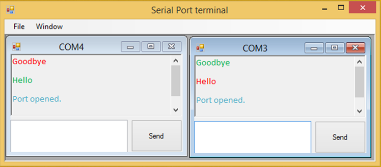
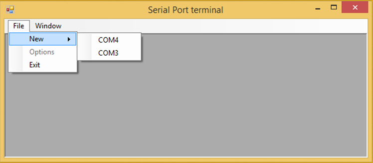
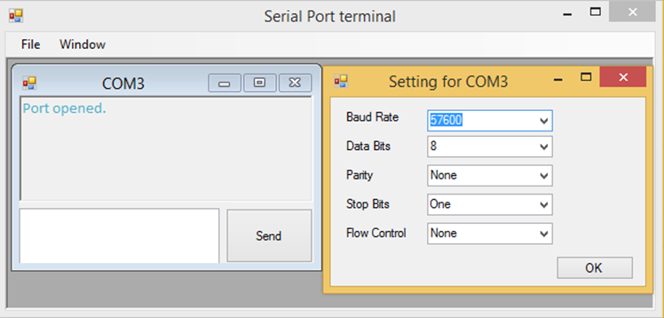

Serial port terminal
====================

The application was used to diagnose and debug protocols that use the serial port. It displayed incoming messages and allowed messages to be sent to the chat window. All port parameters were configurable with the ability to view multiple ports at the same time.

This application is a simple serial port terminal. MDI application
is capable to have many ports opened at same time. It's possible to
set up the various configurations as baudrate, stopbits, etc.
I have tested this by making loop, windows on the screen, from USB to
USB to serial converter, Serial modem cable, USB to serial
converter to USB and another window on the screen.

Prerequities
------------

Serial port properly installed.
Windows 10
Visual studio 2017 community

I have developed this on:
Windows 7
Visual Studio 2012

The project was moved into newer version with no changes.
